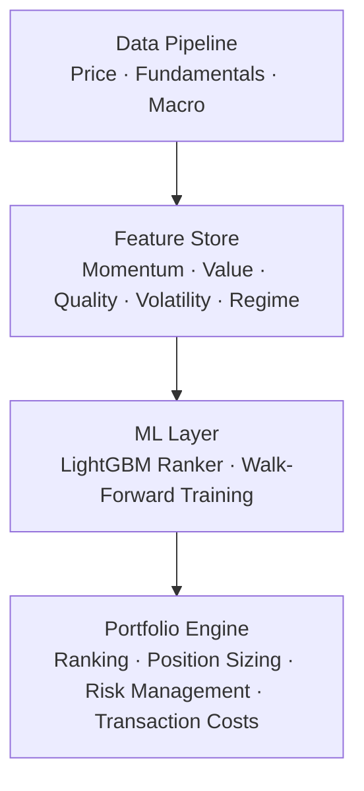

# PersonalQuant

## Architecture

For a PersonalQuant system that can run reliably over the long term, the project is organized into four layers:

### 1. Data Pipeline

Collects, validates, and stores market prices, company fundamentals, and macroeconomic data.

### 2. Feature Store

Transforms raw data into reusable investment features, including momentum, value, quality, volatility, and market-regime indicators.

### 3. ML Layer

Trains and evaluates predictive ranking models, such as a LightGBM ranker, using walk-forward training to avoid look-ahead bias.

### 4. Portfolio Engine

Converts model rankings into investable portfolios by handling security selection, position sizing, risk controls, and transaction costs.

## Moving-Average Feature Parameter Evaluation

Test multiple fast/slow period combinations:

| Fast / Slow Period | Intended Use                               | Trade-off                                                 |
| ------------------ | ------------------------------------------ | --------------------------------------------------------- |
| `10 / 20`          | Short-term trend                           | More signals, but more noise and potential false signals. |
| `20 / 60`          | Approximately one-month prediction horizon | A balanced medium-short-term trend signal.                |
| `20 / 120`         | Medium-term trend filter                   | Fewer, more persistent trend signals.                     |
| `60 / 200`         | Long-term market regime or major trend     | Slow-moving signal intended for broad trend context.      |
